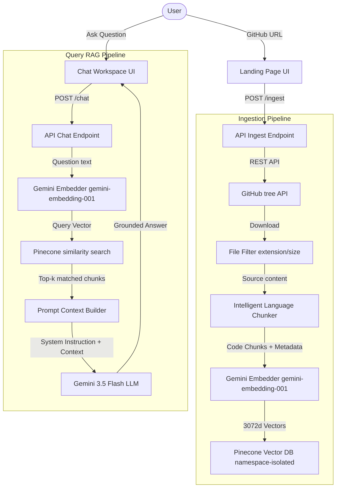

# AI GitHub Codebase Assistant (RAG)

A production-quality full-stack Retrieval-Augmented Generation (RAG) application that lets you enter any public GitHub repository URL and ask natural language questions about its codebase. 

The application downloads the repository, filters files, performs language-aware chunking, generates embeddings, stores them in Pinecone, and answers user queries with source-code references and syntax-highlighted code blocks.

**Cost: $0** — Runs entirely on the free tiers of Google Gemini and Pinecone Serverless.

---

## 🚀 Key Features

*   **FastAPI Backend**: Async, modular, cleanly structured backend using Pydantic validation, structured logging, and dependency injection.
*   **Next.js 15 Frontend**: Uses the latest App Router, React Server Components (where applicable), Suspense boundaries, and modern shadcn/ui components.
*   **Intelligent Language-Aware Chunking**: Splits code files along natural logical boundaries (classes, functions, statements) instead of arbitrary characters using LangChain language parsers.
*   **Google Gemini Integration**: 
    *   **Embeddings**: Generated using `gemini-embedding-001` (3072 dimensions).
    *   **Chat Completion**: Generated using `gemini-3.5-flash` (fast, grounded, high context window).
*   **Pinecone Serverless**: Ingestion is namespace-isolated per repository to ensure fast and targeted query lookups.
*   **Collapsible Citations**: Chat response messages link directly to the source code blocks, line ranges, and include similarity match scores.

---

## 🛠️ Architecture & Data Flow



---

## 📁 Repository Directory Structure

```text
codebase-rag/
├── backend/
│   ├── app/
│   │   ├── api/v1/endpoints/  # API endpoints (ingest.py, chat.py)
│   │   ├── core/              # Config, exceptions, logging
│   │   ├── models/            # Pydantic Request/Response models
│   │   ├── services/          # Services (github, chunking, embedding, vector_store, rag)
│   │   ├── utils/             # Text cleaning and file filtering utilities
│   │   └── main.py            # FastAPI entry point
│   ├── requirements.txt       # Python dependencies
│   └── Dockerfile             # Production container config
│
└── frontend/
    ├── src/
    │   ├── app/               # Next.js 15 pages and routers
    │   ├── components/        # React components (ui/, landing/, chat/)
    │   ├── hooks/             # Client state hooks (use-ingest, use-chat)
    │   ├── lib/               # Utility helper functions and API client
    │   └── types/             # Shared TypeScript type definitions
    ├── package.json           # Node dependencies
    └── tailwind.config.ts     # Tailwind v4 configuration
```

---

## ⚙️ Setup Instructions

### Prerequisites
*   Python 3.10+
*   Node.js 18+ and npm
*   A Google AI Studio API key (free: [https://aistudio.google.com/](https://aistudio.google.com/))
*   A Pinecone API key (free: [https://app.pinecone.io/](https://app.pinecone.io/))
*   *(Optional)* A GitHub personal access token (increases API limit from 60 to 5000 requests/hour)

---

### 1. Setup Backend

1.  Navigate to the `backend` folder:
    ```bash
    cd backend
    ```

2.  Create a `.env` file from the example:
    ```bash
    cp .env.example .env
    ```

3.  Configure your API keys in the `.env` file:
    ```env
    GOOGLE_API_KEY=your_google_api_key_here
    PINECONE_API_KEY=your_pinecone_api_key_here
    PINECONE_INDEX=codebase-rag
    GITHUB_TOKEN=your_optional_github_token_here
    ```

4.  Install the python dependencies:
    ```bash
    pip3 install -r requirements.txt
    ```

5.  Start the FastAPI development server:
    ```bash
    python3 app/main.py
    ```
    The backend server will run on `http://localhost:8000`. You can access the interactive API docs at `http://localhost:8000/docs`.

---

### 2. Setup Frontend

1.  Navigate to the `frontend` folder:
    ```bash
    cd ../frontend
    ```

2.  Install packages:
    ```bash
    npm install
    ```

3.  Start the Next.js development server:
    ```bash
    npm run dev
    ```
    The frontend will run on `http://localhost:3000` (or `http://localhost:3001` if port 3000 is occupied).

---

## 🔍 Verification & Testing

To test the application end-to-end:
1.  Open the frontend application in your browser (`http://localhost:3000`).
2.  Paste a public GitHub repository link (e.g. `https://github.com/postmanlabs/httpbin` or select the preset option).
3.  Click **Ingest**. You will see the animated loader showing step progression.
4.  Once ingestion is complete, click **Enter Workspace Chat**.
5.  Start asking questions (e.g., *"How do I run the server?"*, *"Explain the routing configuration"*). You will receive formatting answers with collapsible source blocks.
